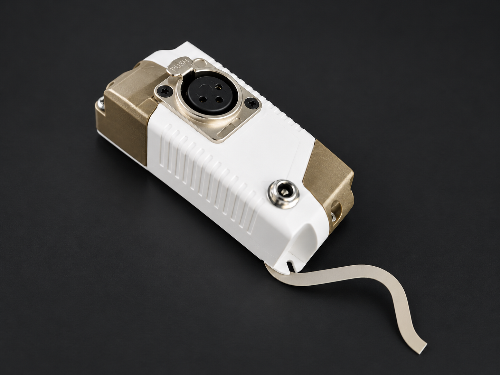

# Wi-Fi Art-Net → DMX Converter

<p align="center">
  
</p>

<p align="center">
  <strong>Compact wireless Art-Net to DMX interface for lighting control systems.</strong>
</p>

<p align="center">
  <a href="YOUR_STORE_URL">🛒 Buy the Product</a>
  &nbsp;&nbsp;•&nbsp;&nbsp;
  <a href="YOUR_DOCUMENTATION_URL">📖 Documentation</a>
  &nbsp;&nbsp;•&nbsp;&nbsp;
  <a href="YOUR_ISSUES_URL">🐛 Issues</a>
</p>

---

## Overview

This project is a compact **Wi-Fi Art-Net to DMX converter** designed to connect
network-based lighting software and controllers with conventional DMX lighting fixtures.

The device receives Art-Net data over Wi-Fi and converts the lighting data into
standard DMX output.

It is intended for applications such as:

- Stage lighting
- DJ lighting
- Architectural lighting
- LED fixtures
- Small lighting installations
- Show control
- Event lighting
- Custom lighting systems
- PC-based DMX control

---

## Features

- 📡 **Wi-Fi Art-Net**
- 🎛️ **1–3 Art-Net universes**
- 💡 **Standard DMX output**
- ⚡ **5–24 VDC input**
- 📦 Compact enclosure
- 🔌 Designed for integration with DMX lighting systems
- 🖥️ Compatible with Art-Net capable lighting software
- 🔧 Suitable for custom lighting installations

---

# How It Works

```text
     Lighting Software
            │
            │
            ▼
        Wi-Fi Network
            │
            │ Art-Net
            ▼
   ┌─────────────────────┐
   │                     │
   │   Art-Net → DMX     │
   │      Converter      │
   │                     │
   └─────────────────────┘
            │
            │ DMX512
            ▼
      DMX Lighting
        Fixtures
